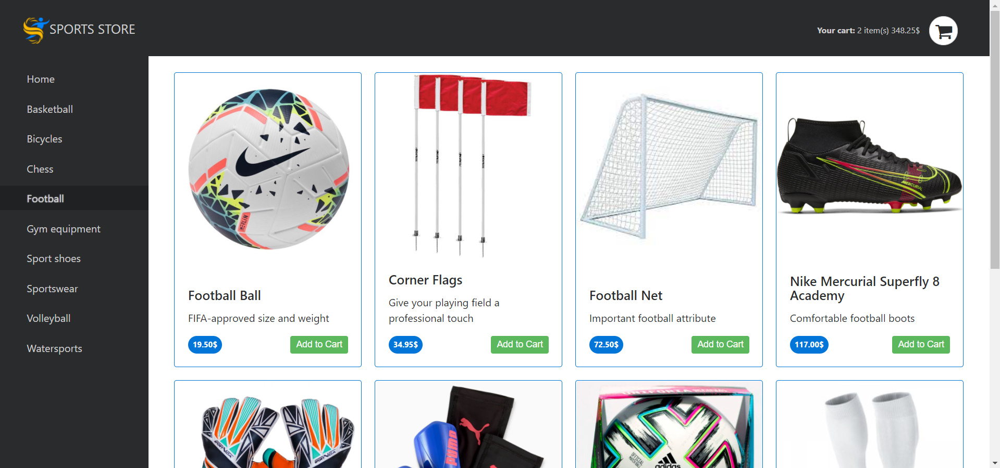
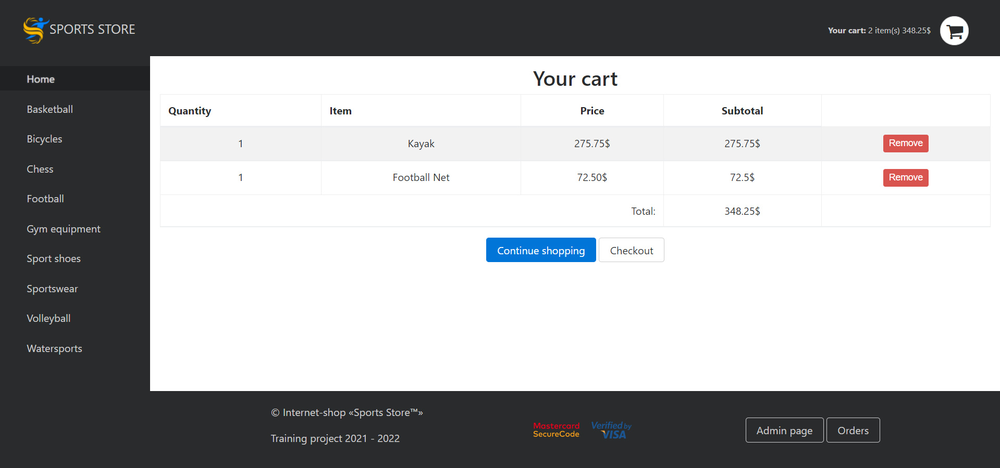
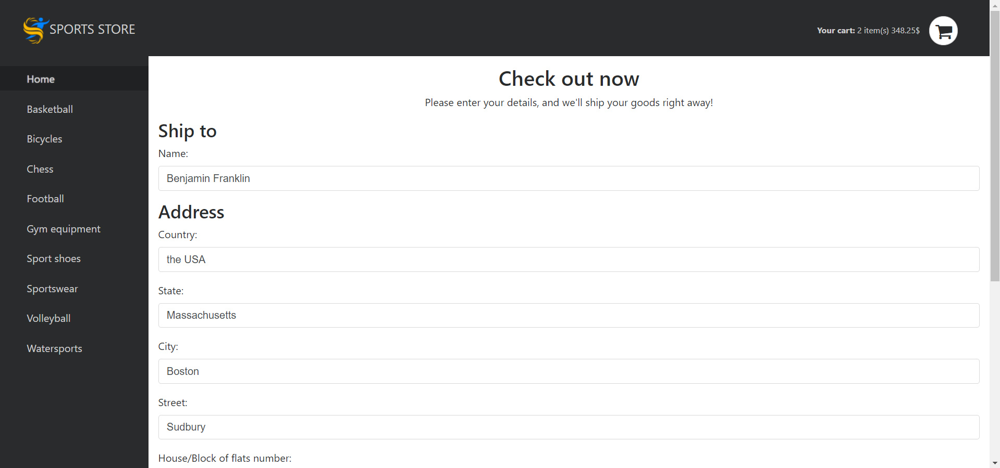
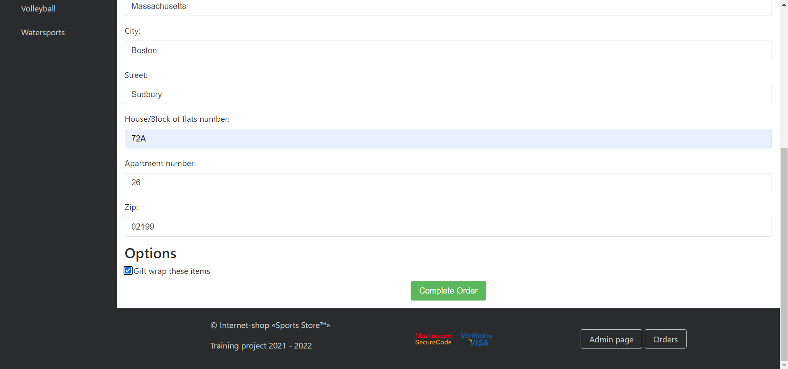
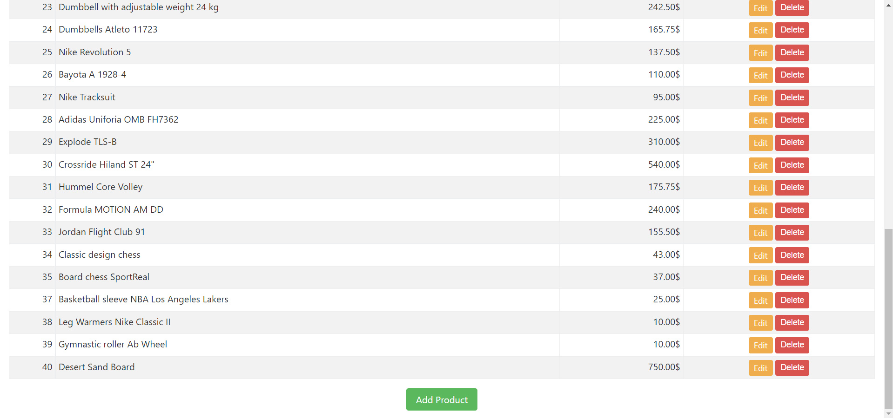
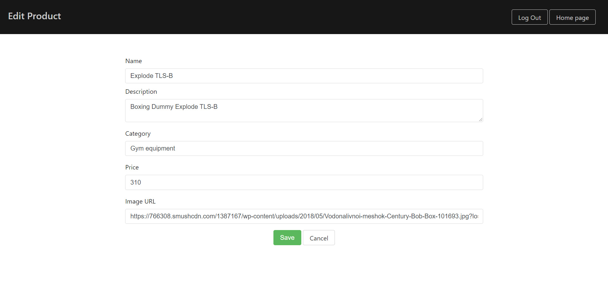
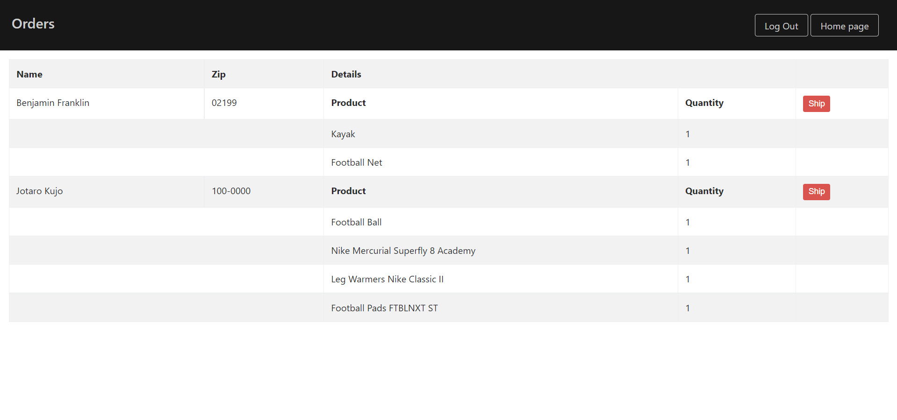

# [Sports Store](https://sportsstore2022.azurewebsites.net/)

***
# Description:
## Sports Store is an online sporting goods store.

### Pages with product cards, categories list
***

### Cart page
***

#####

### Check out page
## The store enables customers to select the necessary goods and add them to the cart, edit the contents of the cart, enter personal data for delivery of goods.
***

### Admin products page
***

### Edit product page
***

### Orders management page
## Furthermore, the store allows the administration to create new product cards, edit and delete old ones, manage delivery data. You must be logged in as an administrator to access this feature.